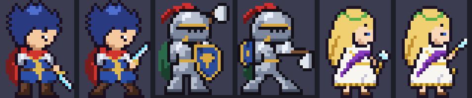
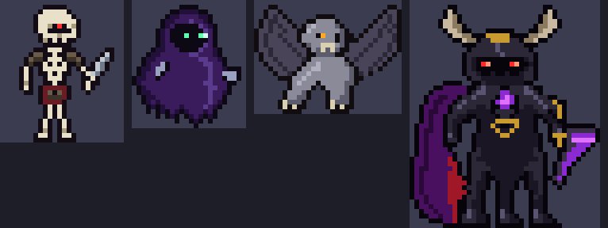
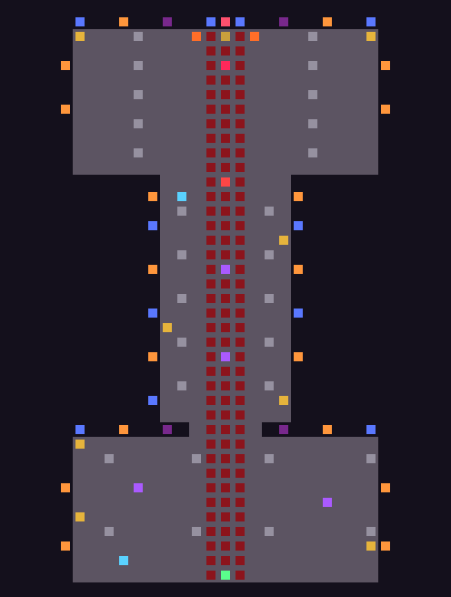

# Chronicle of the Endless Night — an HD-2D RPG for Unity 6.3 LTS

A complete, compact HD-2D style JRPG: pixel-art characters living in a lit 3D diorama with a
tilt-shift depth of field, bloom, flickering torchlight and moonlit stained glass. Three heroes
storm the Dark Lord's castle, fight Octopath-style "Shield & Break" battles and face
**Malzarath, the Dark Lord** on his throne.




## The party

| | Hero | Class | Style |
|---|---|---|---|
| ⚔️ | **Aren** | Spellblade (magic warrior, protagonist) | Sword + elemental sword arts: Flame/Frost Edge, Thunder Rend, Aether Blade |
| 🛡️ | **Gareth** | Guardian (armored warrior, sidekick) | Full plate, tower shield and greataxe: Cleave, Bulwark (taunt), Iron Wall, Earthsplitter |
| ✨ | **Theia** | Arch Mage | Greek chiton, golden laurel and wand: Asclepian Heal, Boreas' Gale, Thunderbolt of Zeus, Hymn of Apollo, Phoenix Rite |

## Getting started

1. Open the folder with **Unity 6.3 LTS** (6000.3.x). The required packages (URP, Input System, uGUI)
   are listed in `Packages/manifest.json` and are fetched automatically.
2. On first import the editor script `HD2DProjectSetup` configures everything:
   a URP pipeline asset with a Forward+ renderer and post-processing, template materials,
   Linear color space and the scene `Assets/Scenes/Main.unity`.
   You can re-run it any time from **HD-2D RPG ▸ Run Project Setup**.
3. Open `Assets/Scenes/Main.unity` (or **HD-2D RPG ▸ Open Main Scene**) and press **Play**.

> The game also boots in *any* scene via `[RuntimeInitializeOnLoadMethod]`, so pressing Play
> in an empty scene works too. If Unity asks to enable the new Input System backends, either
> answer works: input supports both the Input System package and the legacy Input Manager.

## Controls

| Action | Keyboard | Gamepad |
|---|---|---|
| Move / navigate | WASD or arrow keys | Left stick / D-pad |
| Run | Shift | West (X/□) |
| Confirm / check / open chest | Z, Enter, Space | South (A/✕) |
| Cancel / back | X, Backspace, Esc | East (B/○) |
| Open menu | C, Tab, M, Esc | North (Y/△) / Start |
| Boost up / down (battle), switch member (menu) | E / Q | RB / LB |

## What's in the game



* **Exploration** – the castle is built from an ASCII map (`CastleMap.cs`): the *Hall of Ashes*,
  the *Moonlit Gallery* and the *Throne of Eternal Night*. Walls and pillars between the camera and
  the party sink away (diorama cut-away), the caravan of followers trails the leader, enemies are
  visible wandering symbols that chase you, 8 treasure chests hold new gear, and two save
  crystals heal the party and record a retry point.
* **Battles** – speed-based rounds with a visible turn order (this round and next).
  * *Shield & Break*: every enemy shows a shield count and hidden weaknesses (`?`). Hitting a
    weakness reveals it and removes a shield point; at zero the enemy is **Broken**: it loses its
    turns until the end of the next round and takes double damage.
  * *Boost*: each hero gains 1 BP per round (max 5). Press **E** while choosing a command to spend
    up to 3 BP: extra hits for attacks, more potency for skills.
  * Attack / Skills / Items / Defend / Flee, buffs & debuffs, taunt, KO & revive, critical hits,
    EXP, gold, item drops, level-ups and new skills.
  * **The Dark Lord** has two phases: at half HP he unleashes his true form, changes weaknesses,
    raises his shield and acts twice per round.
* **Menu** (C/Tab) – party overview cards (portrait, level, HP/MP gauges, ATK/DEF/MAG/RES/SPD/LUK,
  EXP to next level, equipment), **Items**, **Skills** (healing arts usable in the field),
  **Equipment** (4 slots, live stat-change preview), **Status** (full parameters, base + equipment
  bonuses, skill list, bio) and **Config** (music/SFX volume, tilt-shift depth of field strength).
* **Story** – opening scene, pre-boss confrontation, and a dawn ending with credits.

## The HD-2D look

* Pixel sprites (`Resources/HD2D/sprites.txt`, point-filtered) rendered on upright, lit,
  shadow-casting quads that yaw toward the camera and tilt back slightly.
* Narrow-FOV camera looking down from the south (`CameraRig`), with **Bokeh depth of field focused
  on the party** so the foreground and background melt into a miniature/tilt-shift blur.
* Bloom on HDR torch flames, braziers, stained glass and spell effects; vignette, film grain,
  contrast/saturation grading and exponential fog (`PostFX.cs`).
* Dozens of flickering point lights (Forward+), fake volumetric moonlight shafts, drifting dust
  motes and embers, magic circles and particle-based spell effects (`BattleFX.cs`).

## Project layout

```
Assets/HD2DRPG/
  Editor/HD2DProjectSetup.cs   URP + materials + scene setup (auto-runs on first import)
  Resources/HD2D/sprites.txt   all pixel art as editable ASCII (palette + rows)
  Scripts/
    Core/    Game (state machine & story), GameInput, PostFX, Mats (URP materials)
    Data/    Defs, Database (party, skills, equipment, items, enemies), PartyState
    Art/     PixelArt (sprite parser), ProcTex (procedural stone, carpet, glass, FX textures)
    Audio/   Synth (procedural chiptune BGM + SFX), AudioManager
    World/   CastleMap, CastleBuilder, EnvKit, SpriteActor, PartyController, CameraRig, FX, Decor
    Battle/  BattleManager, Battler, BattleStage, BattleFX
    UI/      UIKit, MenuScreen, BattleHUD, FieldUI
```

Everything — art, music, geometry and UI — is generated from code and text at runtime, so the
project has no binary assets. Tweak `Database.cs` for balance, `CastleMap.cs` for the level
layout, and `sprites.txt` to redraw characters.
